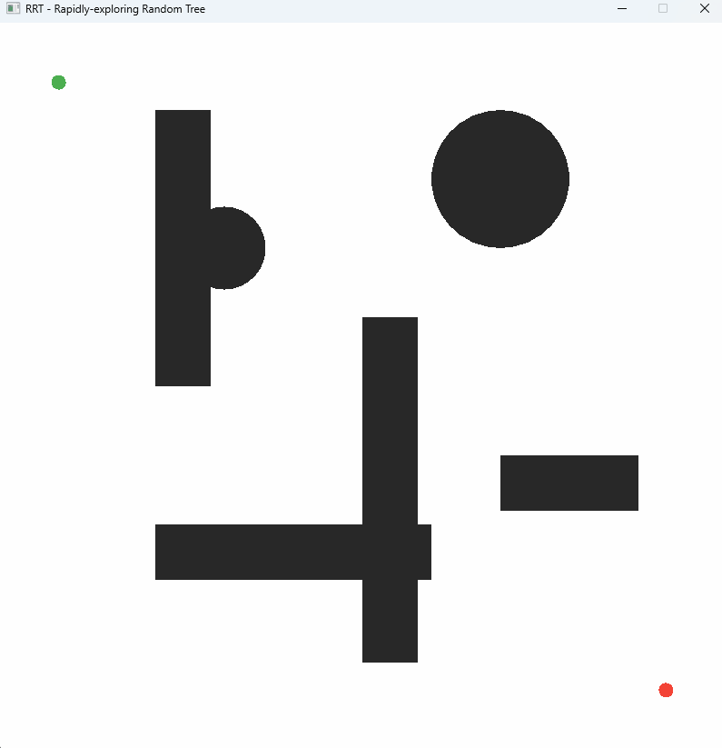
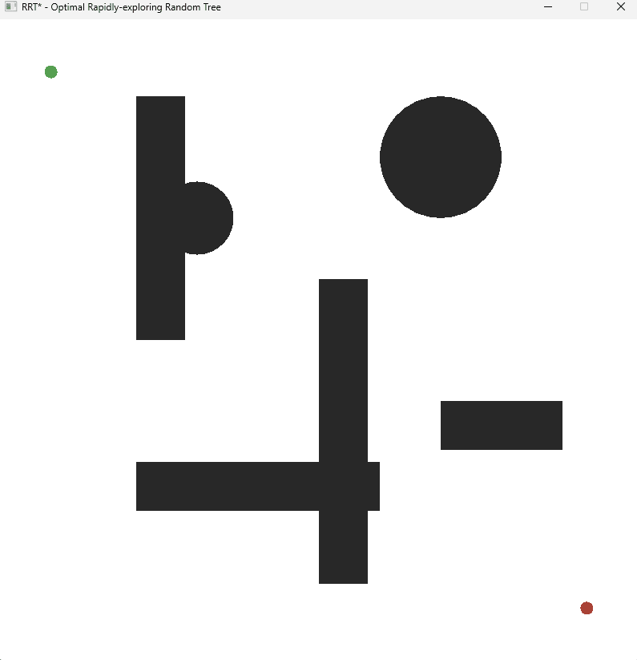
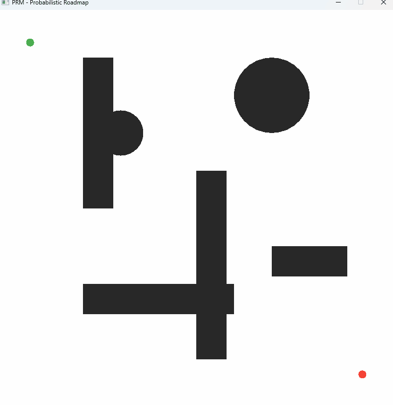
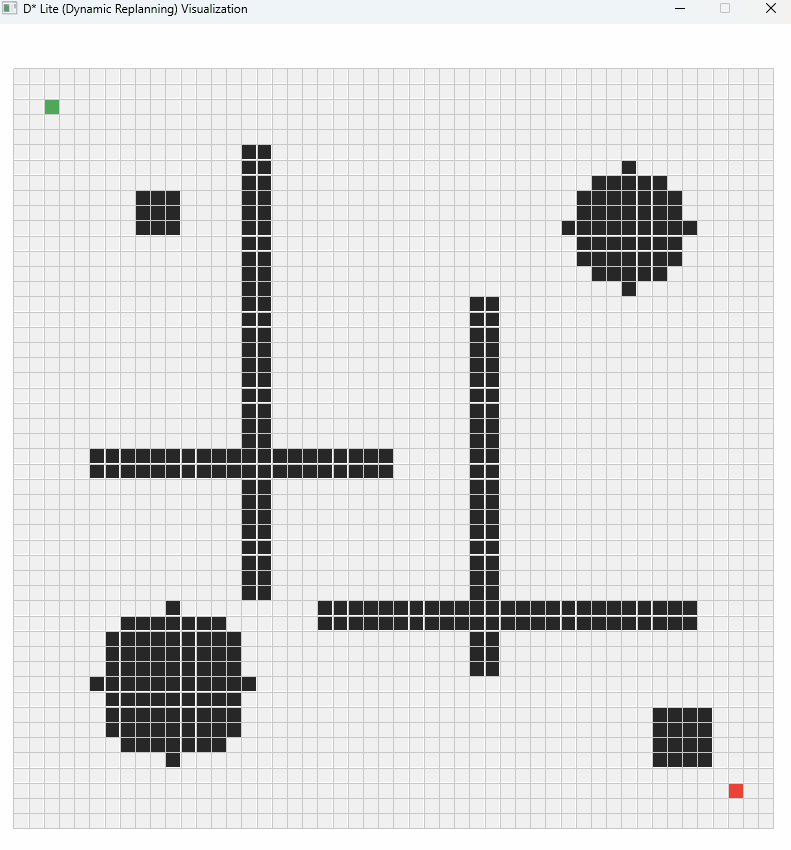

# Motion Planning Algorithms

A C++ implementation of motion planning algorithms with SFML visualization.

### A* Search
<p align="center">
  
</p>

### Theta* (Any-Angle Planning)
<p align="center">
  
</p>

### RRT (Rapidly-exploring Random Tree)
<p align="center">
  
</p>

### RRT* (Optimal RRT)
<p align="center">
  
</p>

### RRT-Connect (Bidirectional RRT)
<p align="center">
  
</p>

### PRM (Probabilistic Roadmap)
<p align="center">
  
</p>

### D* Lite (Dynamic Replanning)
<p align="center">
  
</p>

## Project Structure

```
MotionPlanning/
├── CMakeLists.txt
├── include/
│   ├── core/
│   │   ├── types.hpp              # Basic types (Vec2, Cell, AABB, etc.)
│   │   ├── grid.hpp               # Grid world representation
│   │   └── environment.hpp        # Continuous 2D space with geometric obstacles
│   ├── algorithms/
│   │   ├── search_algorithm.hpp   # Base class for grid search algorithms
│   │   ├── bfs.hpp                # Breadth-First Search
│   │   ├── dijkstra.hpp           # Dijkstra's algorithm
│   │   ├── astar.hpp              # A* with heuristics
│   │   ├── theta_star.hpp         # Theta* (Any-angle planning)
│   │   ├── d_star_lite.hpp        # D* Lite (Dynamic replanning)
│   │   ├── sampling_algorithm.hpp # Base class for sampling-based planners
│   │   ├── rrt.hpp                # Rapidly-exploring Random Tree
│   │   ├── rrt_star.hpp           # RRT* (Optimal RRT with rewiring)
│   │   ├── rrt_connect.hpp        # RRT-Connect (Bidirectional RRT)
│   │   └── prm.hpp                # PRM (Probabilistic Roadmap)
│   └── visualization/
│       ├── colors.hpp             # Color definitions
│       └── visualizer.hpp         # SFML visualization
├── src/
│   ├── core/
│   │   ├── grid.cpp
│   │   └── environment.cpp
│   ├── algorithms/
│   │   ├── search_algorithm.cpp
│   │   ├── bfs.cpp
│   │   ├── dijkstra.cpp
│   │   ├── astar.cpp
│   │   ├── theta_star.cpp
│   │   ├── d_star_lite.cpp
│   │   ├── rrt.cpp
│   │   ├── rrt_star.cpp
│   │   ├── rrt_connect.cpp
│   │   └── prm.cpp
│   ├── visualization/
│   │   └── visualizer.cpp
│   └── main.cpp
└── examples/
    ├── grid_search.cpp
    ├── rrt_demo.cpp
    ├── rrt_star_demo.cpp
    ├── rrt_connect_demo.cpp
    ├── prm_demo.cpp
    ├── theta_star_demo.cpp
    └── d_star_lite_demo.cpp
```

## Requirements

- CMake 3.16+
- C++17 compiler
- SFML 3.0+

## Installing SFML

### Windows (vcpkg)
```bash
vcpkg install sfml:x64-windows
```

### Ubuntu/Debian
```bash
sudo apt install libsfml-dev
```

### macOS
```bash
brew install sfml
```

## Building

```bash
mkdir build
cd build
cmake ..
cmake --build .
```

If using vcpkg:
```bash
cmake -DCMAKE_TOOLCHAIN_FILE=[vcpkg-root]/scripts/buildsystems/vcpkg.cmake ..
```

## Running

```bash
./motion_planning      # Interactive grid search visualizer
./example_grid         # Grid search algorithm comparison
./example_rrt          # RRT demo with continuous space
./example_rrt_star     # RRT* demo with path optimization
./example_rrt_connect  # RRT-Connect demo with bidirectional trees
./example_prm          # PRM demo with probabilistic roadmap
./example_theta_star   # Theta* any-angle planning demo
./example_d_star_lite  # D* Lite dynamic replanning demo
```

## Controls

### Grid Search (`motion_planning` / `example_grid`)

| Key | Action |
|-----|--------|
| Left Click | Draw obstacle / Set start/goal |
| Right Click | Erase obstacle |
| S | Set Start mode |
| G | Set Goal mode |
| D | Draw Obstacle mode |
| 1 | BFS algorithm |
| 2 | Dijkstra algorithm |
| 3 | A* algorithm |
| Space | Run search |
| R | Reset visualization |
| C | Clear all |
| Esc | Quit |

### RRT (`example_rrt`)

| Key | Action |
|-----|--------|
| Left Click | Place obstacle / Set start/goal (depends on mode) |
| Right Click | Remove obstacle under cursor |
| S | Set Start mode |
| G | Set Goal mode |
| D | Draw Rectangle mode |
| O | Draw Circle mode |
| N | Normal mode (no drawing) |
| +/- | Adjust obstacle size (in draw mode) or step size |
| Space | Run RRT |
| R | Reset tree (keep obstacles) |
| C | Clear all obstacles |
| Esc | Quit |

### RRT* (`example_rrt_star`)

Same controls as RRT, plus:

| Key | Action |
|-----|--------|
| T | Toggle continue-after-goal mode |
| Space | Run RRT* |

### RRT-Connect (`example_rrt_connect`)

Same controls as RRT.

### PRM (`example_prm`)

Same controls as RRT, plus:

| Key | Action |
|-----|--------|
| K | Decrease k (neighbor count) |
| L | Increase k (neighbor count) |
| +/- | Adjust sample count (in normal mode) |
| Space | Build roadmap and find path |

### Theta* (`example_theta_star`)

| Key | Action |
|-----|--------|
| Space | Run Theta* search |
| R | Reset visualization |
| Esc | Quit |

### D* Lite (`example_d_star_lite`)

| Key | Action |
|-----|--------|
| Space | Start planning / Toggle auto-move |
| N | Step robot one cell (manual mode) |
| Left Click | Add obstacle (triggers replan) |
| Right Click | Remove obstacle (triggers replan) |
| R | Reset everything |
| Esc | Quit |

## Implemented Algorithms

### Graph-Based Search (Discrete Grid)
- [x] BFS (Breadth-First Search)
- [x] Dijkstra's Algorithm
- [x] A* with multiple heuristics (Manhattan, Euclidean, Chebyshev, Octile)
- [x] Theta* (Any-angle planning with line-of-sight shortcuts)
- [x] D* Lite (Dynamic replanning with incremental search)

### Sampling-Based Planning (Continuous Space)
- [x] RRT (Rapidly-exploring Random Tree)
- [x] RRT* (Optimal RRT with rewiring)
- [x] RRT-Connect (Bidirectional RRT)
- [x] PRM (Probabilistic Roadmap)

